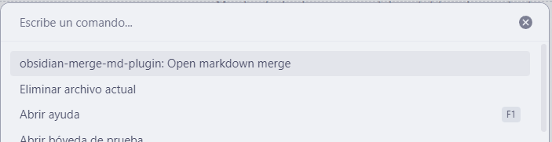

# Obsidian Merge MD Plugin

*Nota: Este plugin se encuentra actualmente en desarrollo.*

## Introducción

El **Obsidian Merge MD Plugin** es una herramienta diseñada para usuarios de Obsidian que desean combinar múltiples archivos Markdown ubicados en una carpeta específica, incluyendo sus subcarpetas, en un único archivo consolidado. Esta funcionalidad es especialmente útil para unificar notas dispersas en un solo documento coherente.

## Características

- **Búsqueda Recursiva**: Explora todas las subcarpetas dentro de la carpeta seleccionada para identificar todos los archivos Markdown disponibles.
- **Combinación de Archivos**: Fusiona el contenido de todos los archivos Markdown encontrados en un solo archivo.
- **Nombrado Automático**: El archivo resultante se nombra automáticamente como `[nombre-de-la-carpeta]-merged-files.md` y se guarda en la carpeta original seleccionada.

## Instalación

*Instrucciones para instalar el plugin una vez esté disponible.*

## Uso

1. **Apertura del Modal**: Accede al modal de selección de carpetas desde el menú principal de Obsidian.
2. **Selección de Carpeta**: Escribe el nombre de la carpeta que contiene los archivos Markdown que deseas combinar. El autocompletado te ayudará a encontrar la carpeta correcta.
3. **Confirmación**: Haz clic en el botón de confirmación para iniciar el proceso de combinación.

*Inserte aquí una imagen ilustrativa del proceso de selección de carpetas.*

## Ejemplo de Uso

Supongamos que tienes la siguiente estructura de carpetas:

```
proyectos/
├── proyecto1/
│   ├── nota1.md
│   └── nota2.md
└── proyecto2/
    ├── nota3.md
    └── subproyecto/
        └── nota4.md
```

Si seleccionas la carpeta `proyecto2`, el plugin buscará recursivamente todos los archivos `.md` dentro de `proyecto2` y sus subcarpetas, combinando `nota3.md` y `nota4.md` en un nuevo archivo llamado `proyecto2-merged-files.md` ubicado en la carpeta `proyecto2`.

*Inserte aquí una imagen mostrando la estructura de carpetas antes y después de la combinación.*

## Consideraciones

- **Integridad de Datos**: El plugin no modifica los archivos originales; simplemente crea un nuevo archivo con el contenido combinado.
- **Orden de Combinación**: Los archivos se combinan en el orden en que se encuentran durante la búsqueda recursiva.

## Estado Actual

Este plugin está en fase de desarrollo. Las funcionalidades descritas están sujetas a cambios y mejoras. Se recomienda a los usuarios realizar copias de seguridad de sus datos antes de utilizar el plugin en entornos de producción.

## Recursos Adicionales

- **Foro de Obsidian**: Participa en discusiones y comparte tus experiencias con otros usuarios en el [Foro de Obsidian](https://forum.obsidian.md/).
- **Repositorio del Plugin**: Accede al código fuente y reporta problemas en nuestro [repositorio de GitHub](https://github.com/tu-usuario/obsidian-merge-md-plugin).



---

*Nota: La información proporcionada en este documento es preliminar y puede cambiar a medida que el desarrollo del plugin avance.* 
